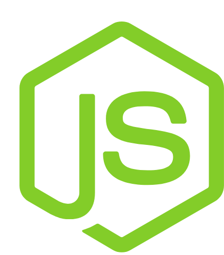

  

# NLW Heat - Backend

## :rocket: Features

* Envio de mensagens em tempo real com socket.io

## :rocket:  Tecnologias

* [Typescript](https://www.typescriptlang.org/)
* [Express](https://expressjs.com/pt-br/)
* [Prisma](https://www.prisma.io/)
* [JSON Web Token](https://jwt.io/)
* [Socket.io](https://socket.io/)

## Próximo nível

- [x] Mudança na arquitetura - Aplicar princípios do solid e da Clean Architecture
- [x] Guardar informações sensíveis no .env
- [ ] Executar o socket.io em outra porta
- [ ] Tratar erros na api

## :construction_worker: Installation

**Você vai precisar do [Node.js](https://nodejs.org/en/download/), [Yarn](https://yarnpkg.com/) e  [Postgres](https://www.postgresql.org/) instalado, após isso é só seguir os comandos abaixo:**

- Clone o repositório e entre dentro da pasta `backend`

- Faça uma cópia do arquivo `.env.example` para o `.env` e preencha com as suas credenciais do GitHub

- Instale as dependências com `yarn`

- Executa as migrations com `yarn prisma migrate dev`

- Inicie o servidor com `yarn dev:server`;

Feito isso a aplicação estará disponível em [`localhost:4000`](http://localhost:4000).
